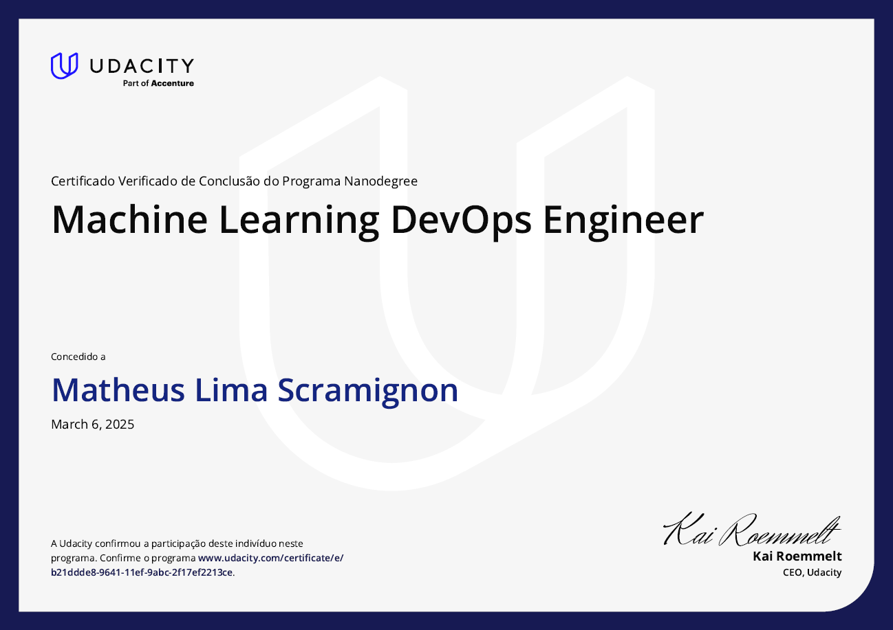

# Udacity-Machine-learning-Devops-Engineer-Nanodegree

This repository contains the four hands-on projects developed during the **Udacity Machine Learning DevOps Engineer Nanodegree** program. Each project focuses on real-world applications of MLOps principles, covering the lifecycle of machine learning models—from development and testing to deployment and monitoring in production.

## Program Overview

The **Machine Learning DevOps Engineer Nanodegree** consists of four key courses, each culminating in a project that solidifies the skills and techniques learned. Below is a brief overview of each course and its corresponding project included in this repository.

---

## 📦 1. **Deploying a Scalable ML Pipeline in Production**

**Course Summary:**  
This course covers how to build and deploy an end-to-end machine learning pipeline. You'll learn about reproducibility, automation using ML pipelines, and deploying using tools like SageMaker.

**Project:**  
Build and deploy a scalable machine learning pipeline using Amazon SageMaker, processing data from S3, training a model, and deploying it via an endpoint. Evaluation and inference are handled in a reproducible manner with pipeline automation.

---

## ⚙️ 2. **Building a Reproducible Model Workflow**

**Course Summary:**  
Focuses on version control for data and models using W&B (Weights and Biases), Git, and MLflow. The course emphasizes reproducibility and tracking experiments effectively.

**Project:**  
Create a fully reproducible ML pipeline leveraging W&B for artifact versioning and MLflow for pipeline management. The model training is encapsulated in well-defined scripts and tested in a controlled environment.

---

## ☁️ 3. **Deploying a Model to a Cloud Application**

**Course Summary:**  
This course introduces model deployment into cloud-native applications using tools such as FastAPI and Docker. Students also learn how to containerize ML models and integrate them into a working API.

**Project:**  
Containerize a trained ML model using Docker and serve it via a FastAPI web application. Deploy the application on a cloud platform and enable real-time prediction via RESTful APIs.

---

## 🔍 4. **Monitoring ML Models in Production**

**Course Summary:**  
Learn to monitor deployed ML models using techniques such as data drift detection and performance tracking. The course emphasizes the need for continual evaluation of model health in production.

**Project:**  
Instrument monitoring for an already deployed ML pipeline. Use tools like Prometheus, Grafana, and custom logging scripts to identify drift, performance degradation, and track key metrics over time.

---

## 🏆 Certification

The completion of this Nanodegree was verified by Udacity.  
**Certificate ID:** b21ddde8-9641-11ef-9abc-2f17ef2213ce  
**Issued to:** Matheus Lima Scramignon  
**Date:** March 6, 2025  
🔗 [View Certificate Online](https://www.udacity.com/certificate/e/b21ddde8-9641-11ef-9abc-2f17ef2213ce)



---

## 🔗 Repository Structure

```bash
Udacity-Machine-learning-Devops-Engineer-Nanodegree/
│
├── Predict Customer Churn with Clean Code/ # Project 1
├── Build Reproducible ML Pipeline/ # Project 2
├── Deploying a Scalable ML Pipeline in Production/ # Project 3
├── ML Model Scoring and Monitoring/ # Project 4
├── .gitmodules
├── README.md
└── LICENSE
